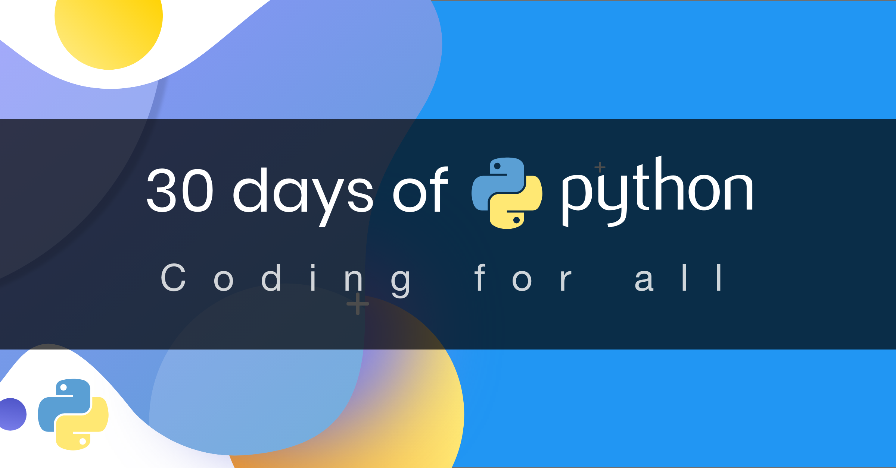

# Python-Cources-30days

此项目翻译自：[Asabeneh/30-Days-Of-Python](https://github.com/Asabeneh/30-Days-Of-Python)

项目目的是给身边朋友参考学习一下Python，Python确实可以提高很多工作效率，同时语法简单，容易理解。

课程全部内容我都会实践一遍，并稍作一些修改。

如果对您有所帮助，可以点赞👍让更多人知道此项目，同时别忘了支持原项目。谢谢～🙏

### 预告

这套课程给我的感觉非常棒，但是一些完全没接触过编程的朋友给我的反馈还是觉得有些操作或者名词理解不了，这让我意识到，这个课程可能还不够‘小白’，因此我将推出自己的一套‘小白’课程，针对完全没有经验的朋友，让他们能完全看懂每一个操作。

计划将为‘小白’课程的每个操作都配备一段讲解视频。

## 课程目录

- [第一天Day01](https://github.com/dashuaixu/Python-Cources-30days/blob/main/30天Python编程挑战 -- 第1天.ipynb)  1⃣️ 

  

