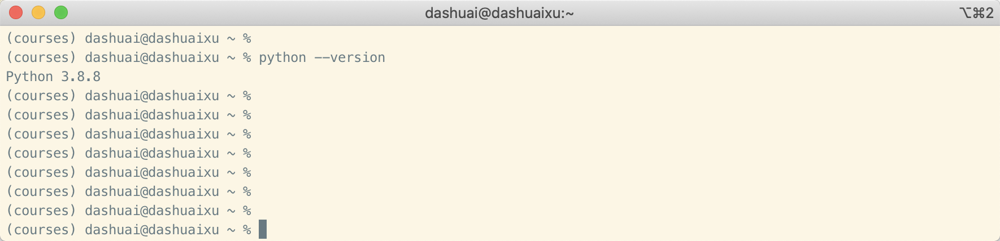
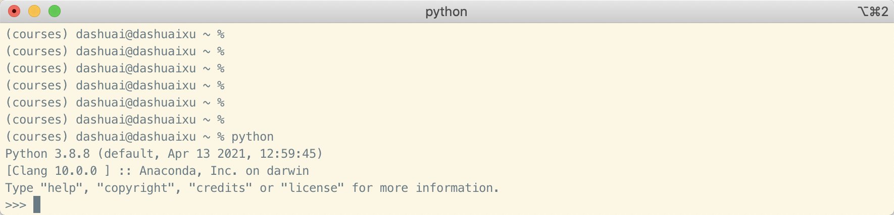
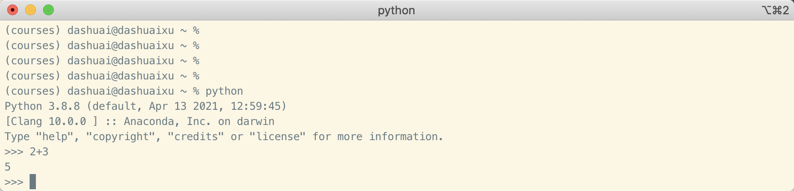
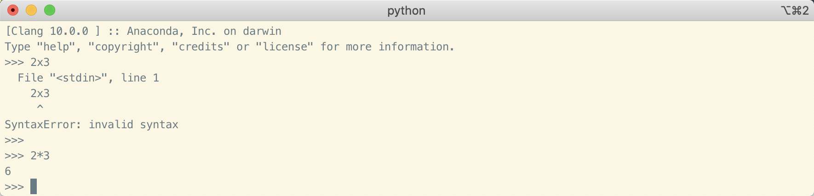
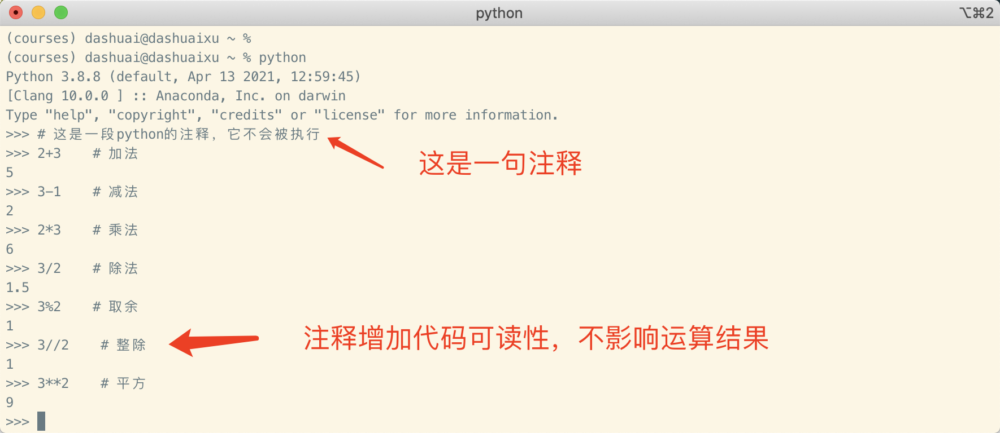
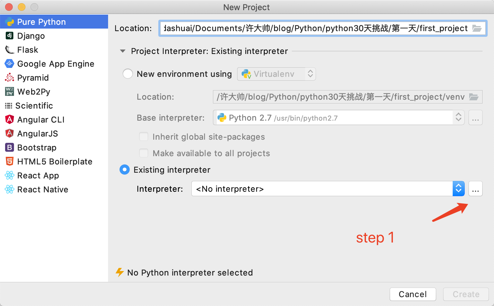
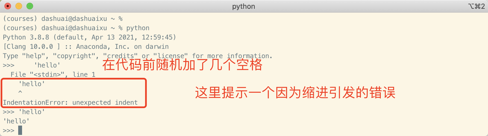
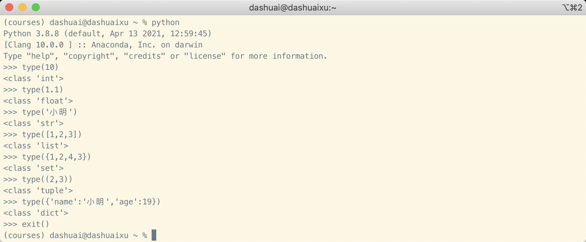

# 30天Python编程挑战 -- 第1天 :triangular_flag_on_post:

> 本项目翻译自[Asabeneh/30-Days-Of-Python](https://github.com/Asabeneh/30-Days-Of-Python)，并稍作修改，如有需要请参考原项目并支持原作者。

:pushpin:项目本意是为了家人和身边的朋友快速了解Python编程。:clown_face:请勿随意转载/发布。

:speech_balloon:可添加TG：https://t.me/xudashuai    :label:备注：挑战python，获取帮助。


---

[TOC]

---


## 欢迎来到Python世界

恭喜您决定加入30天Python编程挑战项目，随着时间推进，您将学到关于Python编程的所有相关知识。


## 项目介绍

Python是一门开源的、高级的通用编程语言，这个项目将带领你一步步学习最新版本的Python。项目被分解为30天，每天又分解出一些小的模块来方便理解和学习，还带有贴合实际的例子以及练习题。


这个项目适合学生以及其他行业想要学习Python的专业人士，它将给你的工作带来帮助。


*如果你对编程一无所知，也不要气馁，编程的前期会有太多的陌生，我们可以先不要‘这是什么？这是为什么？’，先‘要这样！’，跟着完成所有的任务，你会恍然大悟。*


## 为什么学习Python而不是其他编程语言

Python的语法非常接近人类语言，这使得Python非常好学而且容易应用。Python受到很多行业和公司的青睐，例如Google。它可以开发网页程序，桌面端程序，进行操作系统管理，以及构建机器学习相关应用，Python在数据科学和机器学习领域的应用非常广泛，希望这些可以说服你开始学习Python。


## Python环境安装

无论哪个平台，都需要在[Python官网](https://www.python.org/)下载安装包。详细的安装过程这里不做一步步的介绍，和安装其他软件类似。


### 在Windows上安装Python


在官网上鼠标放到Download上，选择Windows，下载最新的版本。然后安装即可。


### 在Mac上安装Python

安装包的下载步骤和Windows一样。下载后安装即可。


### 检查Python安装是否成功

安装完以后，需要检查Python是否安装成功。

顺便说一句，学习编程，同时也要学会使用电脑的命令终端，不同电脑设备打开终端的方式不太一样。

Windows打开终端：按`win + r`键打开**运行**，在**运行**中输入`cmd`按回车。

macOS打开终端：按`command + space`，输入`terminal`按回车。


在终端中输入：`python --version`，输出python版本即安装成功。




### Python Shell

Python是一门脚本语言，可以不用编译，直接一行一行运行。Python Shell是Python自带的交互工具，可以运行Python代码并及时给出结果。


Python shell运行用户输入的代码，并在下一行输出代码运行的结果，打开电脑的命令终端，尝试输入以下命令：`python`




此时Python交互界面已经打开，我们可以在`>>>`后面输入我们的Python代码，然后点击回车，即可运行。

现在尝试输入第一段Python代码：




这就是Python交互工具运行Python代码的样子。现在我们学习怎么退出Python交互界面（注意：不是关闭命令终端）


输入`exit()`点击回车，即可退出Python交互界面。

现在我们学会了如何进入和退出Python交互工具。

在交互工具中，Python会自动执行**正确**的Python代码，对于错误的代码，交互工具会提示你，告诉你哪里出现了错误。


可以看到我们输入的`2 x 3`代码出现了错误，没有正确的返回结果，并且提示了错误`SyntaxError: invalid synta`，意思是句法有错误，并且有提示指向`x`。

这是因为在Python中`x`是一个字母，不能作为运算符号，如果想要做乘法运算，需要用`*`。

让我们来看看正确的语法：




我们代码的错误被修复了，得到了想要的结果。

作为一名编程人员，我们在代码编写过程中会经常遇到各种错误并伴随着错误提示，这些错误提示对我们调试代、修复代码的错误很有帮助。当我们熟知了代码中各种错误类型之后，我们将更加擅长对代码的调试修复，除了上面遇到的`SyntaxError: invalid synta`，还会有`IndexError, ModuleNotFoundError, KeyError, ImportError etc`等等，我们还会在接下来的学习中遇到更多其他类型的错误。


现在我们来增加更多的练习来学习使用Python交互工具。打开电脑的命令终端，输入python进入交互界面。


打开交互工具，我们来尝试做一些基础的数学运算（加，减，乘，除，平方）。在开始之前，我们准备一些数学算式。

- 2 + 3 = 5
- 3 - 2 = 1
- 3 * 2 = 6
- 3 / 2 = 1.5
- 3 ^ 2 = 3 x 3 = 9

在Python中，还有两个额外的运算：

- 3 % 2 = 1 => 取余
- 3 // 2 = 1 => 整除


我们把数学表达式通过Python实现一遍。

现在我们打开Python交互界面，在开始写代码之前，让我们给这段代码写一段**注释**，**注释**是不会被执行的，注释可以让代码更加具有可读性，Python中的注释以`#`开头，举个例子：

```
# 这是一段Python注释，因为它是以#开头的
```





在进入到下面内容之前，建议你关闭当前的Python Shell并重新打开，尝试写一些东西。还记得如何退出吗？

输入`exit()`。


### 安装PyCharm编辑器

我们已经学会在Python Shell中编写和测试一些简短的代码，在Python Shell中测试此类代码效率很高，可它并不适合一个大的项目。在真实的工作环境中，开发者会使用不同的代码编辑器来编辑代码，在本次的30天挑战项目中，我们来学习其中一个很常用的代码编辑器，即PyCharm。当然如果你对其他编辑器更加熟悉，你可以用你自己喜爱的。

[PyCharm官方下载链接](https://www.jetbrains.com/pycharm/download)

注：国外官网打开和下载速度很慢，实在下载不了的可加微信让我帮忙下载。


安装的时候先选择30天试用即可。


### 如何使用PyCharm

这就是PyCharm打开的样子，现在我们开始创建我们的第一个项目。


点击`Create New Project`


在创建新项目的界面，我们需要配置一些信息

- 顶部的`location`是项目的目录和名称，选择合适的文件夹，取个名字即可
- 接着配置`Project Interpreter`，即本项目的Python解释器，我们之前已经安装了最新版的Python，所以选择`Existing interpreter`，然后点击`interpreter`后面的`...`





接着找到Python的安装目录，找到其中的`bin`文件夹，里面有`python3.x`（版本号和你当初安装的一致），选择即可。


点击`Create`即可创建第一个Python项目。


此时我们学会了使用PyCharm建立Python项目。

此时的项目还是空的，项目文件夹里面一个文件都没有。我们根据自己的需要创建一个Python文件，来编写我们的代码，就拿之前的数学表达式作为例子，在PyCharm中如何实现数学表达式代码的编写？


右键点击项目文件夹，选择新建`new`，然后选择`Python File`，然后输入名称，即可创建一个Python脚本文件，Python文件的后缀名为`.py`，所以一般会将Python脚本文件简称为`py文件`。


此时我们在项目`first_project`中创建了一个Python脚本文件叫做`math.py`。

创建好脚本文件，双击它即可进行编辑。至此我们已经学会在PyCharm中创建项目，并且学会了在项目中创建脚本文件。


在进行到下一步之前，建议大家尝试关闭PyCharm并且重新打开，打开后建立一个新的项目以及在项目下创建脚本文件。


## Python基础

### Python语法

Python脚本可以在Python Shell和代码编辑器（如PyCharm等）中编写。Python文件后缀名为`.py`。


### Python缩进格式

所谓的缩进其实就是空白字符，例如按一下空格键。在很多文档编辑中，我们使用缩进来增加文档的可读性。在Python中，缩进被设计成为代码的一部分，用来组织代码块。在其他多数编程语言中，常设计花括号`{}`来组织代码块，而不是缩紧。Python代码中一个常见的错误就是使用了错误的缩进。





上面的例子可以亲自试一下，在Python代码中使用错误的缩进将会引发错误。


### Python注释

在任何一种编程语言中，注释都是非常重要的。良好的注释习惯可以大大增加代码的可读性。Python不会运行代码中的注释部分，任何以`#`开头的内容都是注释。

例子：

```python
# 这是一行注释
# 这是另一行注释
# 我们都是单行注释
```


### 数据类型

Python中包含了多种数据类型，我们先开始学习一些常见的。现在只需要大概看一下不同数据类型间的形式区别，不用详细理解它们。


#### 数值 Number

- 整型数据 Integer（负数，0，正数），例如：... -3，-2，-1，0，1，2，3 ...
- 浮点数 Float，例如：... -3.5，-2.25，-1.0，0.0，1.0，2.2，3.5 ...
- 复数 Complex，例如：1 + 1j，2 + 4j


#### 字符串 String

字符串的标志是被引号引起来。一般是单引号或者双引号，如果要写多行内容，可以用三引号。

例子：

```python
'小明'

"小红"

"""
今天
天气
很好
"""
```


#### 布尔 Booleans

布尔数据只能True或者False（用来表示结果的真和假，要么是真要么是假），而且首字母必须大写。

例子：

```python
True		# 2 比 1 大吗？结果为True
False		# 1 比 2 大吗？结果为False
```


#### 列表 List

Python列表是一个由各种元素组合而成的有序集合。它和JaveScript中的数组很像。它由`[...]`表示。

例子：

```python
[1, 2, 3, 4]    # 这个数组中的元素全是整数
[1, 2, '小明']   # 这个数组就包含了整数了字符串两种数据结构
[1.1, '小明', [1, 2, 3, 4]]    # 这个列表包含了浮点数、字符串、列表（列表里面可以嵌套列表）
```


#### 字典 Dict

字典是由键值对组成的集合，一个键对应一个值。

例子：

```python
{'name':'Asabeneh', 'country':'Finland', 'age':250, 'is_married':True}
```


#### 元组 Tuple

元组和列表类似，是一个由不同类型数据组成的有序集合，不同的是，元组一旦创建，其数据是不可再改变的。

例子：

```python
('list', 'tuple', 'dict', 1.1, 2)
```


#### 集合 Set

集合也是一个数据的集合，和列表、元组不同的是，集合不是有序的，而且数据是不能重复的。

例子：

```python
{3.14, 9.9, 2.7}
```


#### 查看数据类型

任何一个数据都可以使用`type()`函数来查看它的类型。我们用Python Shell测试一下：




### Python脚本文件

打开我们的电脑文件夹，新建一个文件夹叫做`30DaysOfPython`，在这个文件夹中，我们创建一个文件叫做`helloworld.py`，看后缀名就知道，这将是一个Python脚本文件。然后我们用PyCharm打开它。

在Python Shell中，我们输入一行代码然后按回车，就会将代码的结果**打印**到下一行，这里的自动打印结果是Python Shell为了方便而设计的，实际的代码中，我们如果想要打印一个结果，需要用到`print()`函数。

看看例子：

我们先在打开的`helloworld.py`文件中编写如下代码

```python
# Day 1 - 30DaysOfPython Challenge

print(2 + 3)             # addition(+)
print(3 - 1)             # subtraction(-)
print(2 * 3)             # multiplication(*)
print(3 / 2)             # division(/)
print(3 ** 2)            # exponential(**)
print(3 % 2)             # modulus(%)
print(3 // 2)            # Floor division operator(//)

# 查看数据类型
print(type(10))          # Int
print(type(3.14))        # Float
print(type(1 + 3j))      # Complex number
print(type('Asabeneh'))  # String
print(type([1, 2, 3]))   # List
print(type({'name':'Asabeneh'})) # Dictionary
print(type({9.8, 3.14, 2.7}))    # Set
print(type((9.8, 3.14, 2.7)))    # Tuple
```


然后我们在PyCharm中运行这段代码


你会惊奇地发现，所有的运行结果都打印在下面了。


## 练习题 -- 第1天

### Level 1

1. 查看你正在使用的Python是什么版本的？
2. 打开Python Shell使用数字3和4完成以下运算，并思考他们的结果。
   - 加法
   - 减法
   - 乘法
   - 取余
   - 除法
   - 平方
   - 整除
3. 在Python Shell中写一写
   - 你的名字
   - 你的国家
   - 我将完成30天的挑战
4. 查看下面这些数据的数据类型
   - 10
   - 9.8
   - 3.14
   - 4 - 4j
   - ['Asabeneh', 'Python', 'Finland']
   - Your name
   - Your country

### Level 2

1. 在`30DaysOfPython`文件夹中创建一个`day_1`文件夹，在`day_1`文件夹中创建一个文件`helloworld.py`，在这个文件中重新完成上面的习题1-4，记得在脚本文件中要使用`print()`，并且点击run来运行它。


:tada::tada::tada::tada::tada::tada::tada::tada::tada::tada::tada::tada::tada::tada::tada::tada::tada::tada::tada::tada::tada::tada::tada::tada::tada::tada::tada::tada::tada::tada::tada::tada::tada::tada:

