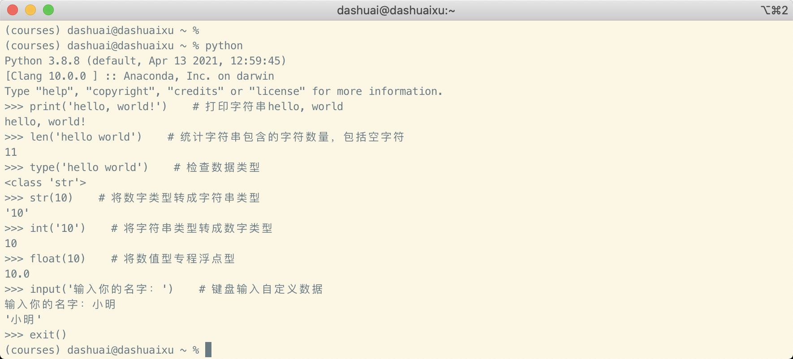

# 30天Python编程挑战 -- 第2天 :triangular_flag_on_post:

> 本项目翻译自[Asabeneh/30-Days-Of-Python](https://github.com/Asabeneh/30-Days-Of-Python)，并稍作修改，如有需要请参考原项目并支持原作者。

:pushpin:项目本意是为了家人和身边的朋友快速了解Python编程。:clown_face:请勿随意转载/发布。

:speech_balloon:可添加微信：xumaimeng，:label:备注：挑战python，获取帮助。


---

[TOC]

---


恭喜进入第二天的挑战，我们已经学会了使用Python Shell和PyCharm，今天开始，大部分的代码需要自己输入并验证。


## 内建函数

Python在设计之初，内建了很多全局函数，这些函数可以随时拿来使用。比较常用的内建函数有：*print()*, *len()*, *type()*, *int()*, *float()*, *str()*, *input()*, *list()*, *dict()*, *min()*, *max()*, *sum()*, *sorted()*, *open()*, *file()*, *help()*, *dir()*，下表列出了全部的内建函数，在[Python官方文档](https://docs.python.org/2/library/functions.html)中可查看详细信息。


我们打开Python Shell尝试使用常见的内建函数：




继续练习一些其他函数：


上面的练习中提及到**python关键字（保留字）**以及打印帮助信息。

关键字是Python语言在设计时预留的保留字，在代码编写时，使用的变量名字不能和关键字冲突，否则会引发错误。

再测试一些内置函数，接着学习其他内容。


## 变量

变量存储在计算机的内存中，每个变量都对应一个存储地址。可以简单地理解为，我们需要在计算机内存中临时存储一个数据，这个数据分为‘数据名’和‘数据值’，变量名称就是‘数据名’，可以是单独一个字母（如：x，y，z），但是更推荐使用有一定含义的变量名，方便理解。

Python变量命名规则：

- 必须以字母或者下划线开头，不能是数字或者其他字符
- 变量名只能是字母数字，下划线
- 变量名区分大小写（Name和name是不同的变量名）

正确变量名：

```python
firstname
lastname
age
country
city
first_name
last_name
capital_city
_if 
year_2019
year2019
current_year_2019
num1
num2
```


错误变量名：

```python
first-name
num-1
1num
```


当变量名太长，为了方便阅读和理解，建议在变量名的每个单词间用下划线分割（例如：first_name）。我们创建一个变量并且给予一个值，这个过程叫做变量声明（如：`first_name = '小明'`），这里的等于号（=）是一个赋值符号。

例子：变量声明

```python
first_name = 'Asabeneh'
last_name = 'Yetayeh'
country = 'Finland'
city = 'Helsinki'
age = 250
is_married = True
skills = ['HTML', 'CSS', 'JS', 'React', 'Python']
person_info = {
   'firstname':'Asabeneh',
   'lastname':'Yetayeh',
   'country':'Finland',
   'city':'Helsinki'
   }
```


我们再来看看关于`print()`和`len()`两个函数的使用。`print()`函数可以放入多个参数，然后将它们打印到屏幕上，所谓参数就是放入函数中参与运算的值，就像不同的食材放入锅内会产生不同的佳肴，不同的参数放入同一个函数也会出现不同的结果。

例如：

```python
print('hello world!')		#	打印字符 hello world！
print('hello', ',', 'world', '!')		# 还是打印 hello world！但是这次被拆分成了不同的参数传给了print函数，参数间逗号隔开
print(len('hello world!'))		# 这里错了函数的嵌套，先运行里面的函数，再运行外面的函数
```


可以打开Python Shell来验证一下上面的结果：


把我们上面学习的变量声明也都输入到Python Shell中：


不要退出Python Shell，接着尝试用print函数打印这些变量，这里要记得，print函数是可以给多个参数的，也可以把变量给它，它就会把变量对应值打印在屏幕上。

例子：


Python还可以一行代码声明多个变量：

下面代码可以使用Python Shell自己试一下

```python
first_name, last_name, country, age, is_married = 'Asabeneh', 'Yetayeh', 'Helsink', 250, True

print(first_name, last_name, country, age, is_married)
print('First name:', first_name)
print('Last name: ', last_name)
print('Country: ', country)
print('Age: ', age)
print('Married: ', is_married)
```


我们还可以使用内置的`input()`函数来将用户输入的内容作为变量的值：

这段代码中定义了两个变量：`first_name,age`，这两个变量的值是在代码运行以后输入进去的。

```python
first_name = input('What is your name: ')
age = input('How old are you? ')

print(first_name)
print(age)
```


## 数据类型

数据类型来重新介绍一遍，Python中数据类型需要熟练掌握，编程中接触最多的就是各种数据类型。

- 使用内置函数`type()`检查数据类型。

  ```python
  first_name = 'Asabeneh'     # str
  last_name = 'Yetayeh'       # str
  country = 'Finland'         # str
  city= 'Helsinki'            # str
  age = 250                   # int, it is not my real age, don't worry about it
  
  # Printing out types
  print(type('Asabeneh'))     # str
  print(type(first_name))     # str
  print(type(10))             # int
  print(type(3.14))           # float
  print(type(1 + 1j))         # complex
  print(type(True))           # bool
  print(type([1, 2,3,4]))     # list
  print(type({'name':'Asabeneh','age':250, 'is_married':250}))    # dict
  print(type((1,2)))                                              # tuple
  print(type(zip([1,2],[3,4])))                                   # set
  ```

  

- 类型转换：学会Pthon中数据类型之间的转换，例如：字符类型转换成整数类型。Python为数据类型转换内置了函数，我们要合理利用这些函数，比如：如果有一个字符串为`'123'`，字符串里面是纯数字，就可以使用`int()`或者`float()`转换成数值型数据，但如果字符串是`'小明'`，要是想转换成数值型，就会出现错误。

  下面我们来练习一下：

  ```python
  num_int = 10
  print('num_int',num_int)         # 10
  num_float = float(num_int)
  print('num_float:', num_float)   # 10.0
  
  # float to int
  
  gravity = 9.81
  print(int(gravity))             # 9
  
  # int to str
  num_int = 10
  print(num_int)                  # 10
  num_str = str(num_int)
  print(num_str)                  # '10'
  
  # str to int
  num_str = '10.6'
  print('num_int', int(num_str))      # 10
  print('num_float', float(num_str))  # 10.6
  
  # str to list
  first_name = 'Asabeneh'
  print(first_name)
  print(first_name)                    # 'Asabeneh'
  first_name_to_list = list(first_name)
  print(first_name_to_list)            # ['A', 's', 'a', 'b', 'e', 'n', 'e', 'h']
  ```


## 数字类型

Python中的数值型数据：

1. 整型Integers：... -3, -2, -1, 0, 1, 2, 3 ...
2. 浮点型Floating：... -3.5, -2.25, -1.0, 0.0, 1.1, 2.2, 3.5 ...
3. 复数Complex：1 + j, 2 + 4j, 1 - 1j


恭喜完成今天的学习内容，可能还有些东西搞不太懂，但是没关系，坚持下去。

下面是一些必要的练习题。


## 练习题

### Level 1

1. 在`30DaysOfPython`文件夹中建立一个文件夹`day_2	`。在这个文件夹中创建一个文件`variables.py`
2. 编写一段Python的注释：'Day 2: 30 Days of python programming'
3. 创建一个first_name变量并且赋值
4. 创建一个last_name变量并缺赋值
5. 创建一个表示国家名称的变量并赋值
6. 创建一个表示日期的变量并赋值
7. 创建一个值为True的变量
8. 尝试用一行代码声明多个变量


### Level 2

1. 检查level1中创建的变量的类型
2. 使用len()函数查看first_name变量的长度
3. 创建一个num_one变量，赋值5；创建一个num_two变量，赋值4
   1. 将变量num_one和num_two的值相加，它们的和赋值给一个新的变量_total
   2. 按照上面的规则继续进行减法、乘法、除法的计算，得到的值分别赋值给_diff、\_product、\_division、\_remainder
4. 已知圆的半径为5厘米：
   1. 计算圆的面积，将值赋给变量\_area_of_circle
5. 使用内置函数`input()`来得到first_name、last_name、country和age这几个变量的值，完成变量的声明
6. 在Python Shell或者编辑器中运行`help('keywords')`来查看Python有哪些保留字